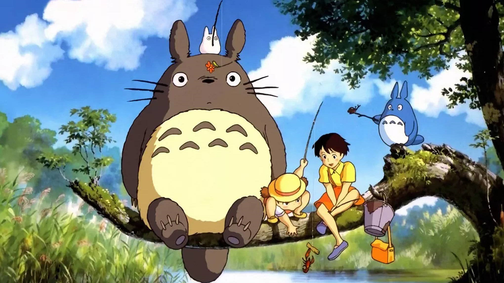
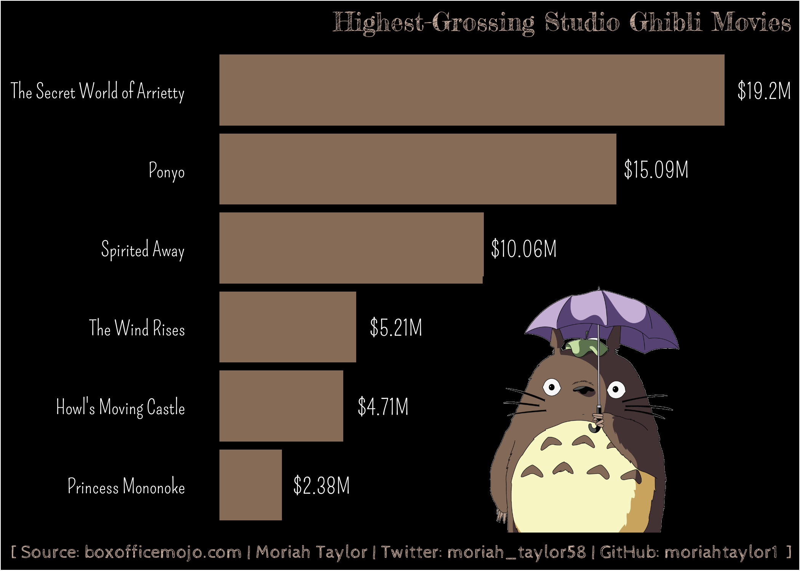

```{r setup, include=FALSE}
knitr::opts_chunk$set(echo = TRUE)
```

## The Data - Studio Ghibli

I built my own dataframe using information from the website https://www.boxofficemojo.com/brand/bn4084398594/?ref_=bo_bns_table_44. For the theme "magical" I thought of some of the tv shows and movies that I watch and decided to visualize the lifetime gross incomes of Studio Ghibli movies.



```{r, message=FALSE, warning=FALSE, include=TRUE}
library(tidytuesdayR)
library(tidyverse)
library(lubridate)
library(extrafont)
library(showtext)
library(rmarkdown)
library(ragg)
library(ggimage)
library(png)
library(grid)
```

```{r, message=FALSE, warning=FALSE, include=TRUE}
movies_list = c("The Secret World of Arrietty", "Ponyo", "Spirited Away", "The Wind Rises", 
           "Howl's Moving Castle", "Princess Mononoke")
gross_list = c(19202743, 15090399, 10055859, 5209580, 4711096, 2375308)
ghibli <- data.frame(movie = movies_list,
                     gross = gross_list/1000000)
```

```{r, message=FALSE, warning=FALSE, include=TRUE}
#add custom text
font_add(family = "title", "FrederickatheGreat-Regular.ttf")
font_add(family = "axis", "Pompiere-Regular.ttf")
font_add(family = "caption", "CabinSketch-Regular.ttf")
showtext_auto()

#load image (image source: wikipedia.org)
totoro_png <- readPNG("totoro_mini.png")
#prep for plot
img <- rasterGrob(totoro_png, interpolate = TRUE)

#create labels
millions <- round(ghibli$gross, 2)
lbls <- paste("$", millions, "M", sep="")

plot_theme <- theme(
 # titles
  plot.title = element_text(family = "title", size = 50, color = "#c5ab9c", hjust=1, vjust=0.5),
  plot.caption = element_text(family = "caption", size = 36, color = "#c5ab9c", hjust = 1),
  
  # panel and plot background
  panel.grid.major = element_blank(),
  panel.grid.minor = element_blank(),
  panel.background = element_rect(fill = "black"),
  plot.background = element_rect(fill = "black"),
  
  # axis
  axis.title = element_blank(),
  axis.text.y = element_text(family="axis", size=40, color="white"),
  axis.text.x = element_blank(),
  axis.ticks = element_blank(),
)

ghibli_plot <- ggplot(ghibli, aes(x=reorder(movie, gross), y=gross)) +
  geom_bar(stat="identity", fill="#866b56") +
  #y scale
  scale_y_continuous(
    breaks = seq(0,20,2)) +
  #bar labels
  geom_text(data = ghibli, nudge_y = 1.5, aes(x=reorder(movie, gross), y=gross, label=lbls), 
            family="axis", size=15, color = "white") +
  #title, subtitle, and caption
  labs(
    title = "Highest-Grossing Studio Ghibli Movies",
    caption = "[ Source: boxofficemojo.com | Moriah Taylor | Twitter: moriah_taylor58 | GitHub: moriahtaylor1  ]  ") + 
  xlab("Lifetime Gross [USD]") + ylab("") +
  #add image
  annotation_custom(img, xmin=-4, xmax=7, ymin=10, ymax=17.8) +
  #flip and theme
  coord_flip() + plot_theme

#ghibli_plot
```

```{r, message=FALSE, warning=FALSE, include=TRUE}
#ggsave("ghibli_plot.png",
       #plot = ghibli_plot,
       #device = agg_png(width = 7, height = 5, units = "in", res = 300))
```

