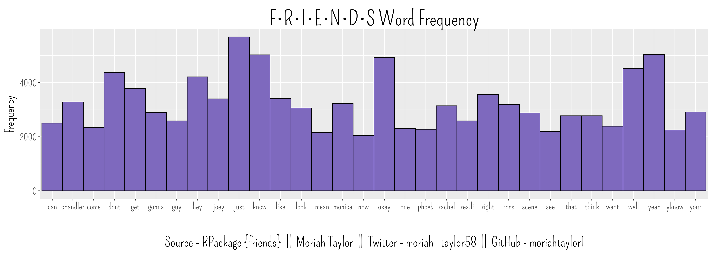

```{r setup, include=FALSE}
knitr::opts_chunk$set(echo = TRUE)
```

## The Data - TV Show "Friends"
For experimental, it seems my peers on Twitter decided to use methods or packages they weren't familiar with. I came across this package {friends} which has a dataset contains tibbles of each show's dialog. I'm going to do some rudamentary natural language processing with it.

```{r, message=FALSE, warning=FALSE, include=TRUE}
#load packages
library(tidyverse)    #data wrangling
library(janitor)    #data cleaning
library(NLP)    #natural language processing
library(corrplot)    #correlation plots
library(dplyr)    #tidyverse
library(data.table)    #data table methods
library(BBmisc)    #misc helper functions
library(ggplot2)    #plotting
library(SnowballC)    #wordStem()
library(friends)    #friends package
library(stringi)    #for character string analysis
library(extrafont)    #font
library(showtext)    #font
library(tm)    #text mining and processing
library(ragg)    #save plots
library(scales)    #reorder()
library(png)    #readPNG
library(grid)   #RasterGrob
```

```{r, message=FALSE, warning=FALSE, include=TRUE}
#add font
font_add(family = "font", "Pompiere-Regular.ttf")
showtext_auto()
```

```{r, message=FALSE, warning=FALSE, include=TRUE}
txt <- Corpus(VectorSource(friends$text))
toSpace <- content_transformer(function(x, pattern) gsub(pattern, " ", x))
txt <- tm_map(txt, toSpace, "/|@|//|$|:|:)|*|&|!|?|_|-|#|")  ## replace special characters by space
txt <- tm_map(txt, content_transformer(tolower)) # Conversion to Lower Case
txt <- tm_map(txt, removePunctuation) # Punctuation can provide gramatical context which supports 
txt <- tm_map(txt, removeWords, stopwords("english")) # common stop Words like for, very, and, of, are, etc,
txt <- tm_map(txt, removeWords, c("the", "will", "The", "also", "that", "and", "for", "in", "is", "it", "not", "to"))
txt <- tm_map(txt, removeNumbers) # removal of numbers
txt <- tm_map(txt, stripWhitespace) # removal of whitespace
txt <- tm_map(txt, stemDocument) # Stemming uses an algorithm that removes common word endings for English
```

```{r, message=FALSE, warning=FALSE, include=TRUE}
dtm <- DocumentTermMatrix(txt)
#frequency
freq <- sort(colSums(as.matrix(dtm)), decreasing=TRUE)
wf <- data.frame(word=names(freq), freq=freq)
```

```{r, message=FALSE, warning=FALSE, include=TRUE}
#frequency histogram
friends_wf <- subset(wf, freq>2000)    %>%
        ggplot(aes(word, freq)) +
        geom_bar(stat="identity", fill="#7E69BE", colour="black", width=1) +
        labs(title = "F•R•I•E•N•D•S Word Frequency",
             caption = "Source - RPackage {friends}  ||  Moriah Taylor  ||  Twitter - moriah_taylor58  ||  GitHub - moriahtaylor1") + xlab("") + ylab("Frequency") + 
        theme(plot.title = element_text(family = "font", size = 90, hjust=0.5, vjust=0),
              plot.caption = element_text(family = "font", size = 60, hjust = 0.5),
              axis.title = element_text(family="font", size=55),
              axis.text.y = element_text(family="font", size=40),
              axis.text.x=element_text(family="font", size=40))
#save plot
ggsave("friends_wf.png",
       plot = friends_wf,
       device = agg_png(width = 14, height = 5, units = "in", res = 300))
```



```{r, message=FALSE, warning=FALSE, include=TRUE}
#load image
joey_png <- readPNG("joey.png")
#prep for plot
img <- rasterGrob(joey_png, interpolate = TRUE)
#joeys phrase
joeys_phrase = c("how", "you", "doin")
#frequency histogram
joey_wf <- subset(wf, word %in% joeys_phrase) %>%
        ggplot(aes(x=reorder(word, -freq), y=freq)) +
        geom_bar(stat="identity", fill="#5a181a", colour="black", width=0.35) + ylim(0,155) +
        #titles
        labs(title = "How (you) doin?",
             caption = "Source - RPackage {friends}  ||  Moriah Taylor  ||  Twitter - moriah_taylor58  ||  GitHub - moriahtaylor1") + xlab("") + ylab("Frequency") + 
        #theme
        theme(plot.title = element_text(family = "font", size = 90, hjust=0.5, vjust=0),
              plot.caption = element_text(family = "font", size = 60, hjust = 0.5),
              axis.title = element_text(family="font", size=55),
              axis.text.y = element_text(family="font", size=40),
              axis.text.x=element_text(family="font", size=60))
#save plot
ggsave("joey_wf.png",
       plot = joey_wf,
       device = agg_png(width = 9, height = 7, units = "in", res = 300))
```

```{r, message=FALSE, warning=FALSE, include=TRUE}

```

