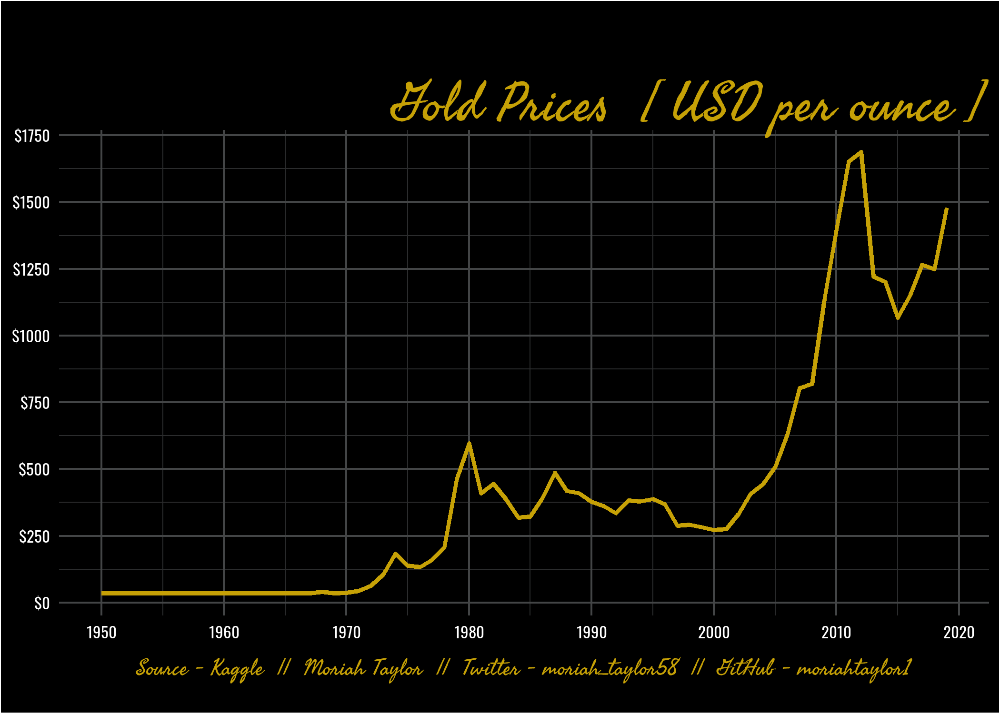

```{r setup, include=FALSE}
knitr::opts_chunk$set(echo = TRUE)
```

## The Data
I found data on historical annual and monthly gold prices dating back to 1950 on Kaggle. The data is sourced from DataHub.

```{r, message=FALSE, warning=FALSE, include=TRUE}
library(tidyverse)
library(lubridate)
library(extrafont)
library(showtext)
library(rmarkdown)
library(graphics)
library(ggdark)
library(ragg)
library(ggimage)
```

```{r, message=FALSE, warning=FALSE, include=TRUE}
gold = read.csv("gold_prices.csv")
```

```{r, message=FALSE, warning=FALSE, include=TRUE}
#create year column
i = 1
while (i<length(gold$Date)){
  gold$Year[i] <- str_split(gold$Date[i], '-')[[1]][1]
  i = i+1
}
gold$Year <- as.numeric(gold$Year)
```

```{r, message=FALSE, warning=FALSE, include=TRUE}
#add custom text
font_add(family = "caption", "Oswald-Regular.ttf")
font_add(family = "title", "SeaweedScript-Regular.ttf")
showtext.auto()

#create theme
plot_theme <- theme(
  # titles
  plot.title = element_text(family = "title", size = 85, color = "#C6A106", hjust=1, vjust=0),
  plot.caption = element_text(family = "title", size = 35, color = "#C6A106", hjust = 0.5),
  
  # panel and plot background
  panel.grid.minor = element_line(color="#2B2C2D"),
  panel.grid.major = element_line(color="#434546"),
  panel.background = element_rect(fill = "black"),
  plot.background = element_rect(fill = "black"),
  
  # axis
  axis.title = element_blank(),
  axis.text = element_text(family="caption", size=25, color="white"),
  axis.ticks = element_blank(),
)

#line graph
gold_plot <- ggplot(gold, aes(x=Year, y=Price, group=1)) +
  geom_line(color="#C6A106", size=1.1) +
  #x scale
  scale_x_continuous(
    breaks = seq(1950, 2020, 10)) +
  scale_y_continuous(
    breaks = seq(0,2000,250),
    labels = paste0("$",seq(0,2000,250))) +
  #title, subtitle, and caption
  labs(
    title = "Gold Prices  [ USD per ounce ]",
    caption = "Source - Kaggle  ||  Moriah Taylor  ||  Twitter - moriah_taylor58  ||  GitHub - moriahtaylor1") + 
  xlab("") + ylab("") + plot_theme

#gold_plot
```

```{r, message=FALSE, warning=FALSE, include=TRUE}
#ggsave("gold_plot.png",
       #plot = gold_plot,
       #device = agg_png(width = 7, height = 5, units = "in", res = 300))
```
